# 主机 BIOS 设置

> [!IMPORTANT]重要
> 由于主板型号众多，无法一一列举，图示仅供参考。请根据您的主板型号查阅说明书，按照其中的指引关闭相关设置。

## Inter 主机 BIOS 设置

### 华硕主板（ASUS）
> [!TIP]信息
> ASUS ROG STRIX B670M GAMING 为例
> 
#### 1. 开机出现主板 Logo 画面时，快速按下 DEL 键，进入 BIOS 界面，如图所示：

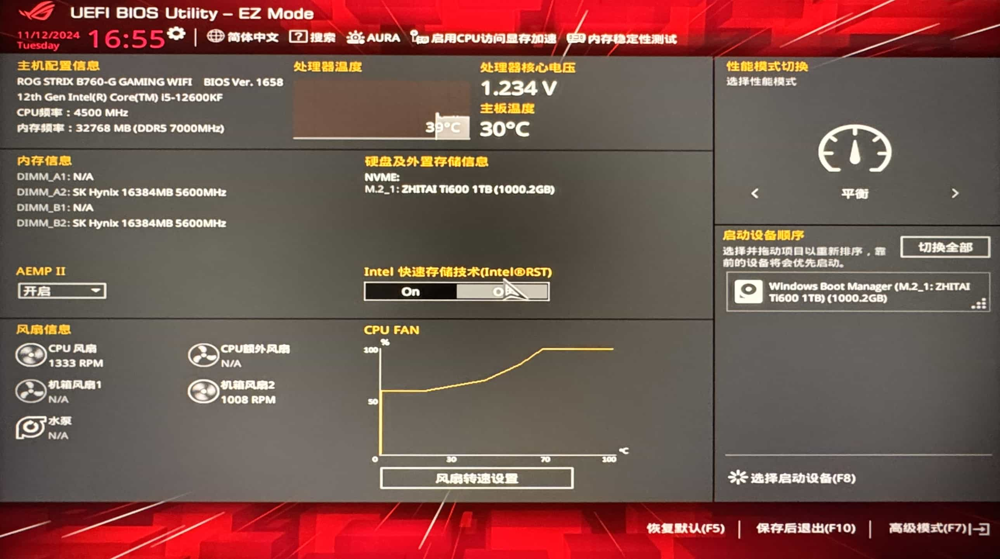

#### 2. 进入 BIOS 按 `F7` 进入`高级模式`，依次选择`高级`、`北桥`，

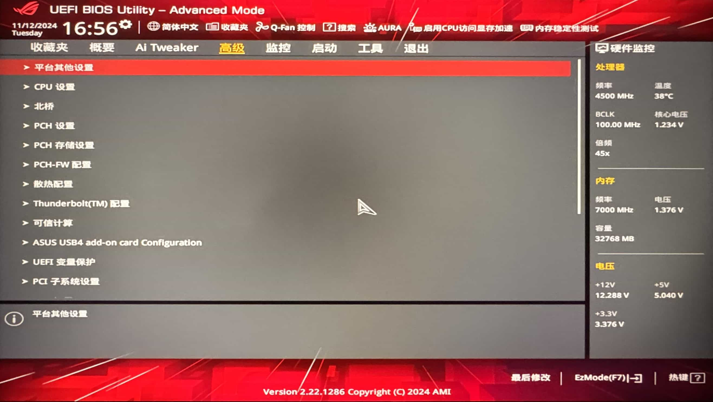

#### 3. 关闭 `Intel VT-D 技术`、`Control IOMMU Per-boot Behavior`二项，将`Enable`更改为`Disable`设置完成后如图所示：

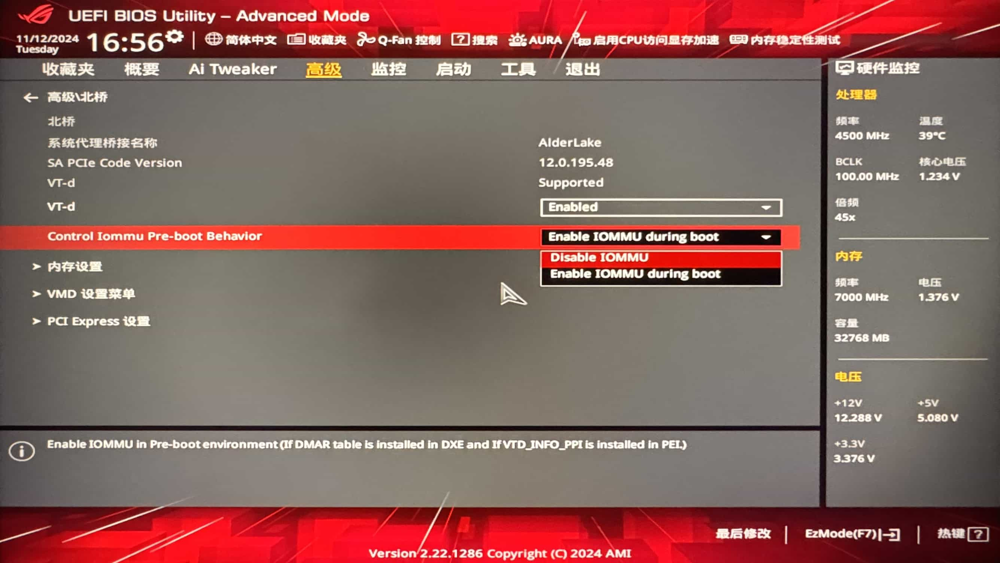

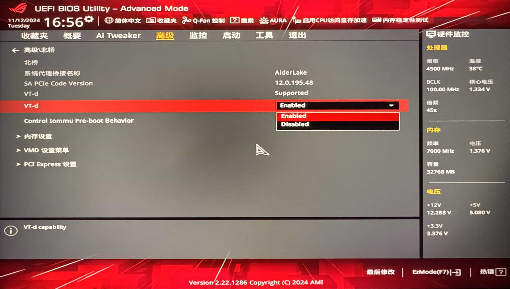

#### 4. 依次选择`启动`、`安全启动`、`密钥管理`，点击`清除安全启动密钥`，设置完成后如图所示：

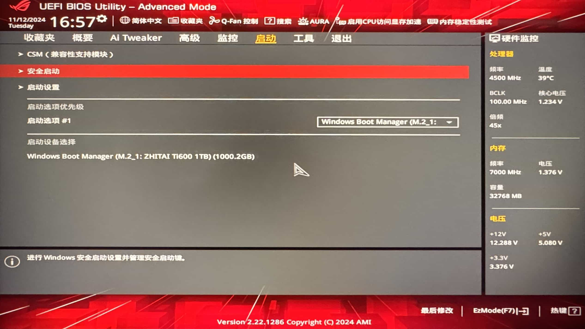

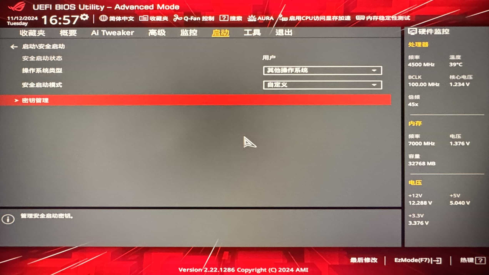

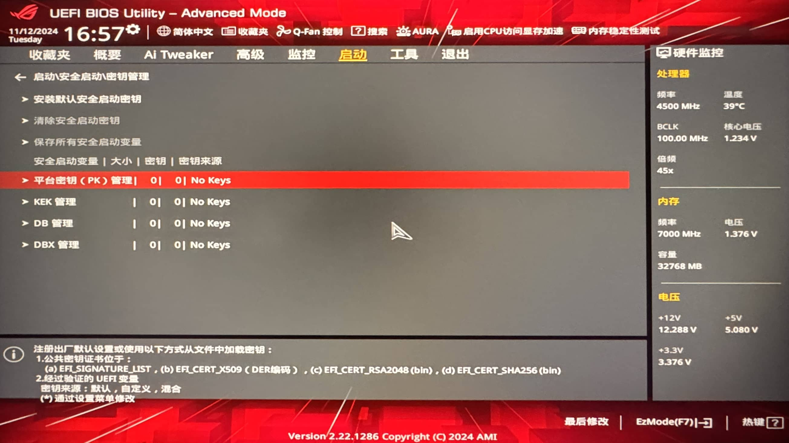

#### 5. 按 F10 保存设置并退出.

### 微星主板（MSI）
> [!TIP]信息
> MSI MPG  Z790 CARBON 为例

#### 1. 开机出现主板 Logo 画面时，快速按下 DEL 键，进入 BIOS 界面，如图所示：

#### 2. 点击屏幕左边`OC`选项，翻至最下方，点击`CPU 特征`选项（英文为`CPU Features`），如图所示：

#### 3. 关闭 `Intel 虚拟化技术`、`Intel VT-D 技术`、`DMA Control Guarantee` 、`Control IOMMU Per-boot Behavior`四项，将`Enable`更改为`Disable`设置完成后如图所示：

#### 4. 按 F10 保存设置并退出，如图所示：

> [!TIP]信息
>如果您的主板 BIOS 上没有`DMA Control Guarantee`选项，请跳过此步骤。
>如果您需要使用`Intel VT-D `或`Intel 虚拟化技术`，并且有`DMA Control Guarantee`选项，只关闭`DMA Control Guarantee`项即可。

### 技嘉主板（敬请期待）

## AMD 主机 BIOS 设置

### 华硕主板（ASUS）
> [!TIP]信息
> ASUS ROG STRIX X670E-A GAMING 为例

#### 1. 开机出现主板 Logo 画面时，快速按下 DEL 键，进入 BIOS 界面，如图所示：

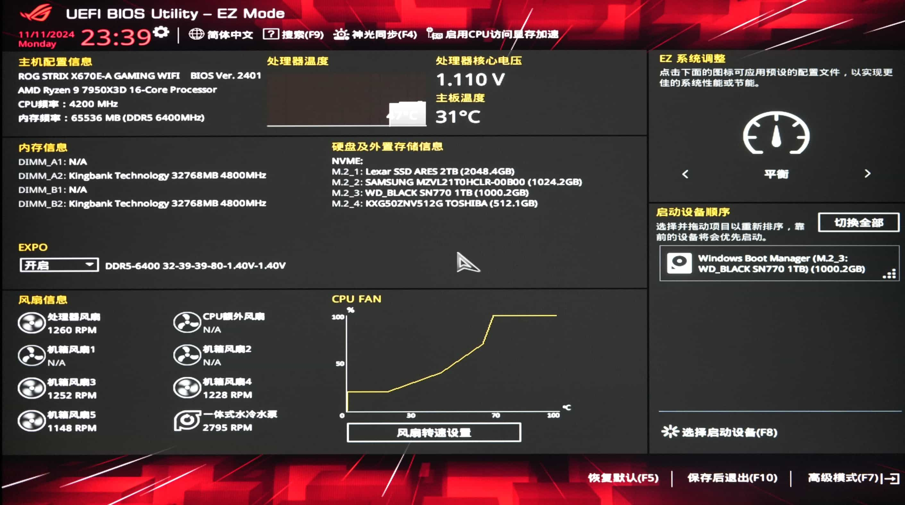

#### 2. 进入 BIOS 按 `F7` 进入`高级模式`，依次选择`高级`、`AMD CBS`，

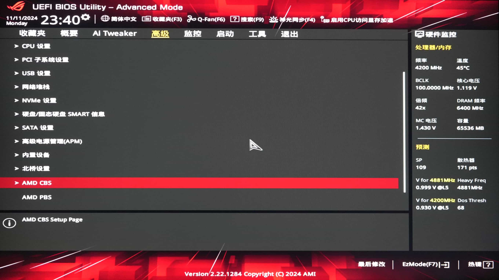

#### 3. 选择 IOMMU ,回车选择`Disable`关闭

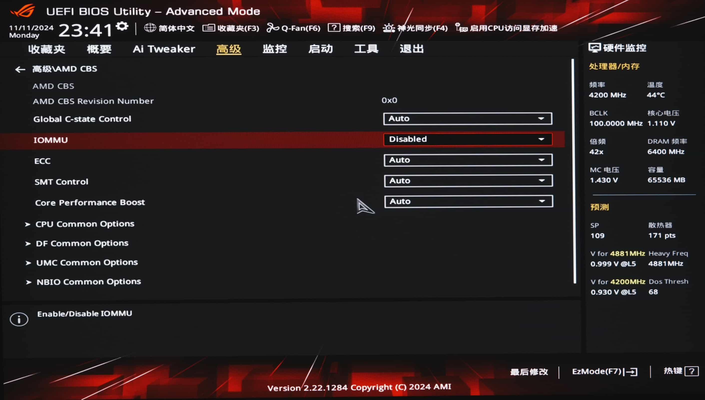

#### 4. F10 保存设置，重启电脑

### 技嘉主板（AORUS）
> [!TIP]信息
> AORUS B550M AORUS ELITE 为例

#### 1. 开机出现主板 Logo 画面时，快速按下 DEL 键，进入 BIOS 界面，如图所示：

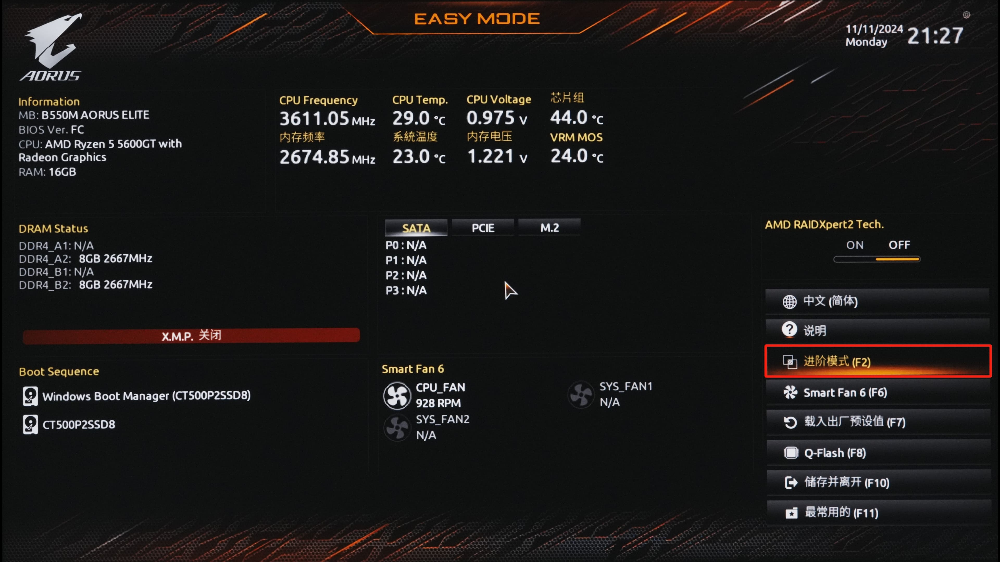

#### 2. 进入 BIOS 按 `F2` 进入`进阶模式`，点击`AMD CBS`
   
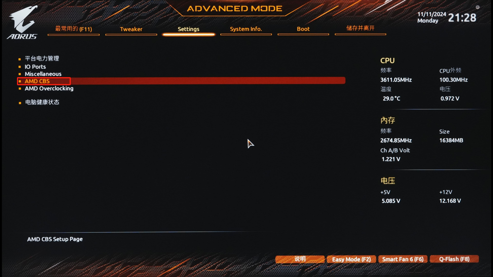

#### 3. 进入 `NBIO Common Options`

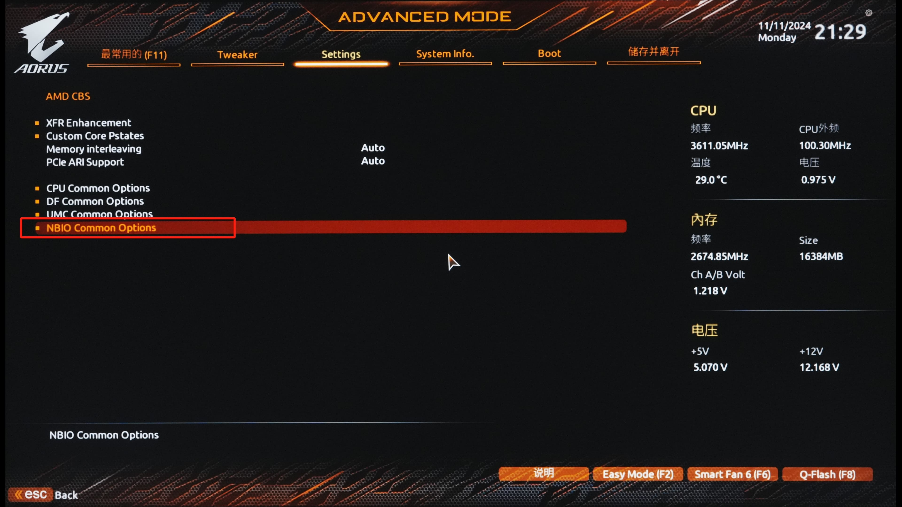

#### 4. 选择 IOMMU ,回车选择`Disable`关闭

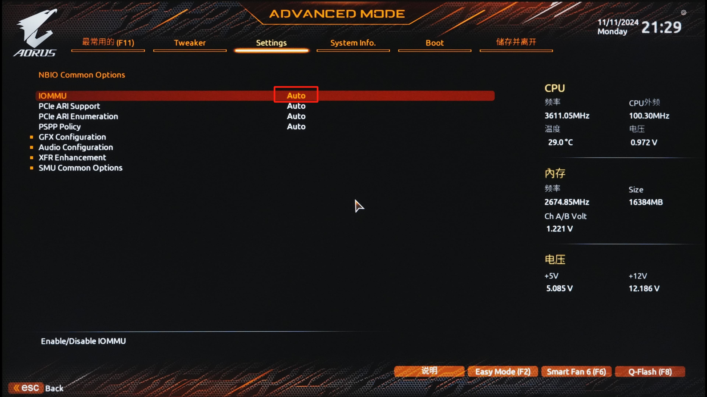

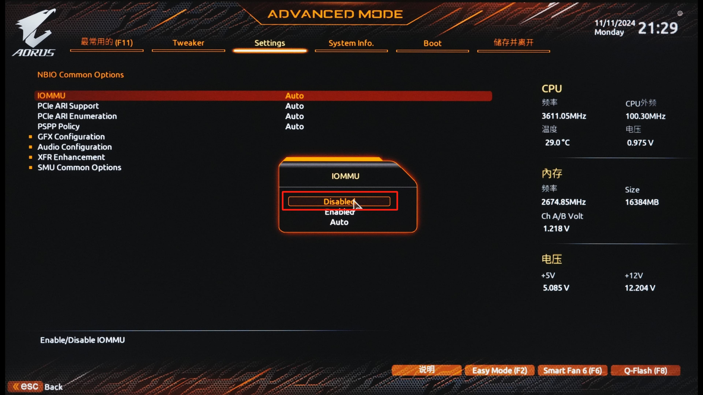

#### 5. F10 保存设置，重启电脑

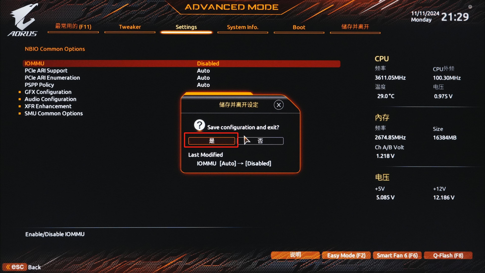

### 微星主板（敬请期待）

