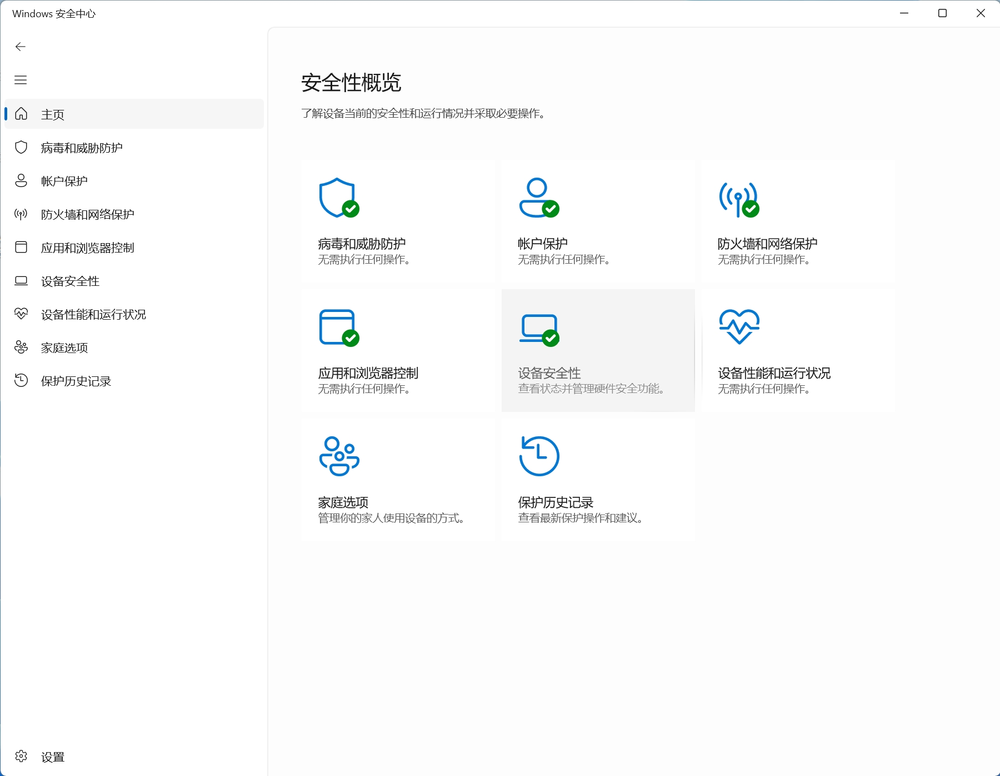
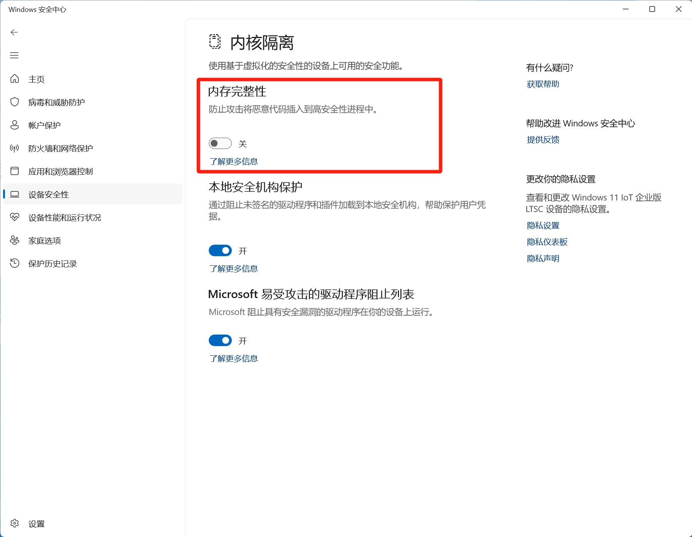

# 主机 Windows操作系统 设置

## `主机`Windows安全中心设置

### Windows 10、11 专业版系统

#### 1. 打开`Windows安全中心`，点击`设备安全性`，如图所示：

#### 2. 点击`内核隔离`，如图所示：

#### 3. 点击`内存完整性`，将`内存完整性`设置为`关闭`，如图所示：

::: info 提示 
如果您的主机操作系统并非Windows系统，请点击`链接`自行翻阅wiki。
::: 

::: tip 
如果您的主机操作系统并非Windows 10、11 专业版系统，请自行重新安装操作系统
推荐系统版本：
- Windows 10 22H2专业版
- Windows 11 24H2专业版
- Windows 10 22H2 LTSC 专业版
- Windows 11 24H2 LTSC 专业版

推荐系统下载地址：[next.itellyou.cn](https://next.itellyou.cn/) `*仅提供链接`

::: 

## 下载`一键关闭Windows内核保护.bat`工具
下载地址：[点击下载](https://baidu.com)

::: danger 警告

运行`一键关闭Windows内核保护.bat`工具，表明您已知悉关闭`Windows内核保护`会为您的计算机带来安全风险，并由自己承担其带来的任何间接性、后果性、惩罚性、偶然性、特殊珠性或刑罚性的损害。

:::