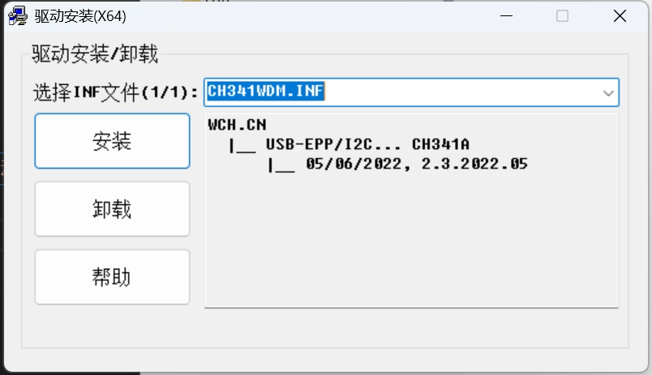
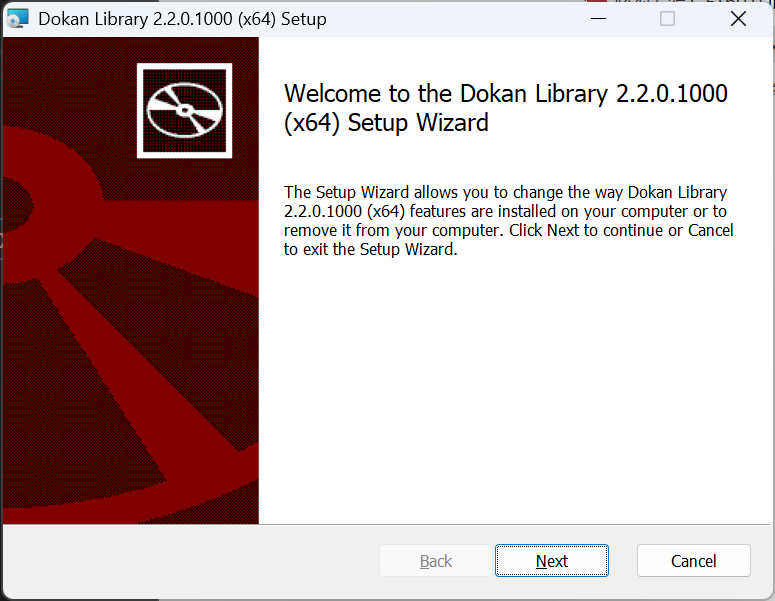
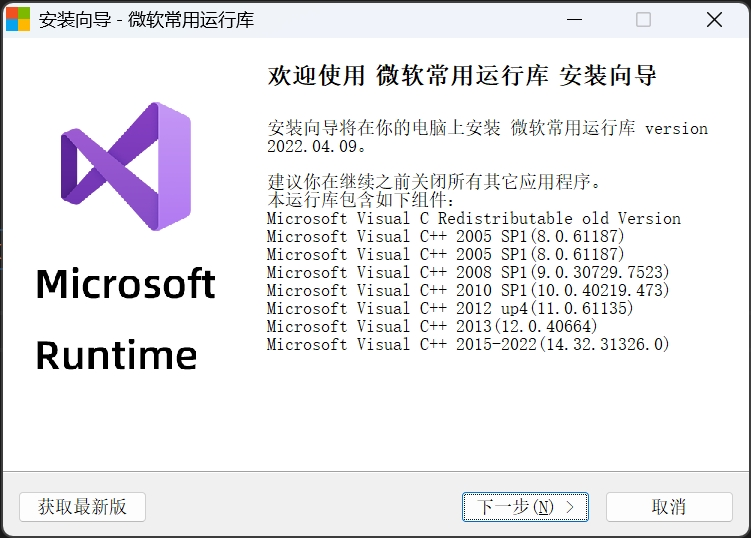

# 驱动安装

## DATA数据口-FT601Q-B芯片组 驱动安装

### 方法1：安装驱动软件包

安装前一步下载的`AllFpgaTool合集`中FTDI 驱动包目录下的`必须安装1_FT601Driver.exe`文件

| 软件名称               | 下载地址一                                                | 下载地址二                                   |
| ---------------------- | --------------------------------------------------------- | -------------------------------------------- |
| AllFpgaTool合集 `推荐` | [夸克网盘地址](https://www.baidu.com)                     | [本地下载](../../src/soft/AllFpgaTool.zip)   |
| FTDI 驱动包            | [官方下载地址*](https://www.ftdichip.cn/Drivers/D3XX.htm) | [本地下载](../../src/soft/1_FT601Driver.exe) |

### 方法2：手动更新驱动软件包 

> [!CAUTION]警告
> 极度不推荐此方法

#### 1.`此电脑`，右键点击`管理`，选择设备管理器，

#### 2.在设备管理器中，找到`其他设备`，展开后，找到`FTID SuperSpeed-FIFO Bridge`

#### 3.右键点击`FTID SuperSpeed-FIFO Bridge`，选择`更新驱动程序`， FTDI 驱动包 [官方下载地址](https://www.ftdichip.cn/Drivers/D3XX.htm) 

#### 4.选择`浏览计算机以查找驱动程序软件`，点击浏览

#### 5.选择`桌面`，点击`FTDI`文件夹，点击`FTDI601驱动`文件夹，点击`x64`文件夹，点击`Win11`文件夹，点击`下一页`

#### 6.自动安装完成

::: tip 提示
- 如果您的电脑是 其他版本的 windows 系统，请选择`对应版本`的文件夹，按照上述步骤安装驱动。
- 如果您的电脑是 32 位 系统，请选择`x32`的文件夹下对应系统版本，按照上述步骤安装驱动。
:::

::: warning 注意
不建议使用 `32位 系统`
:::

## JTAG / UART 烧录口 CH347T 串口驱动安装

### 方法1：安装驱动软件包

- 打开`CH347_UART串口驱动`目录下`CH347_UART串口驱动.exe`文件自动安装即可
  

## 安装Dokan library软件

- 打开`系统运行库`目录下`必须安装2_Dokan_x64_v2.2.0.1000.msi`文件自动安装即可
- 全部自动下一步即可

## 安装VC++系统库集合软件

- 打开`系统运行库`目录下`必须安装3_VC++系统库集合.exe文件`自动安装即可

| 软件名称               | 下载地址一                                                | 下载地址二                                                 |
| ---------------------- | --------------------------------------------------------- | ---------------------------------------------------------- |
| AllFpgaTool合集 `推荐` | [夸克网盘地址](https://www.baidu.com)                     | [本地下载](../../src/soft/AllFpgaTool.zip)                 |
| FTDI 驱动包            | [官方下载地址*](https://www.ftdichip.cn/Drivers/D3XX.htm) | [本地下载](../../src/soft/1_FT601Driver.exe)               |
| 系统运行库             | [下载地址](https://www.baidu.com)                         | [本地下载](../../src/soft/2_ALL_VC++.exe)                  |
| DoKan library          | [官方网站](https://dokan-dev.github.io/)                  | [本地下载](../../src/soft/Dokan_x64_v2.2.0.1000.zip)       |
| 测速软件               | [夸克网盘地址](../../src/soft/TestSpeed.zip)              | [本地下载](../../src/soft/TestSpeed.zip)                   |
| Todesk远程             | [官方网站*](https://www.Todesk.com)                       | [官网下载](https://dl.todesk.com/windows/ToDesk_Setup.exe) |
| WinRAR解压缩工具       | [官方下载地址*](https://www.rarlab.com/download.htm)      | 推荐官网下载最新                                           |
| 7zip解压缩工具         | [官方下载地址*](https://www.7-zip.org/download.html)      | [本地下载](../../src/soft/7z2408-x64.exe)                  |

## 下载地址
::: info 
- `AllFpgaTool合集`本站点上的所有软件和资料均为软件作者提供和网友推荐收集整理而来，仅供学习和研究使用。
- `官方下载地址`指软件开发者官方下载地址。
::: 

::: tip
系统运行库下载地址： [点击下载](https://www.baidu.com)（如果您之前下载了`安装软件合集`，就无需下载该文件）
:::
