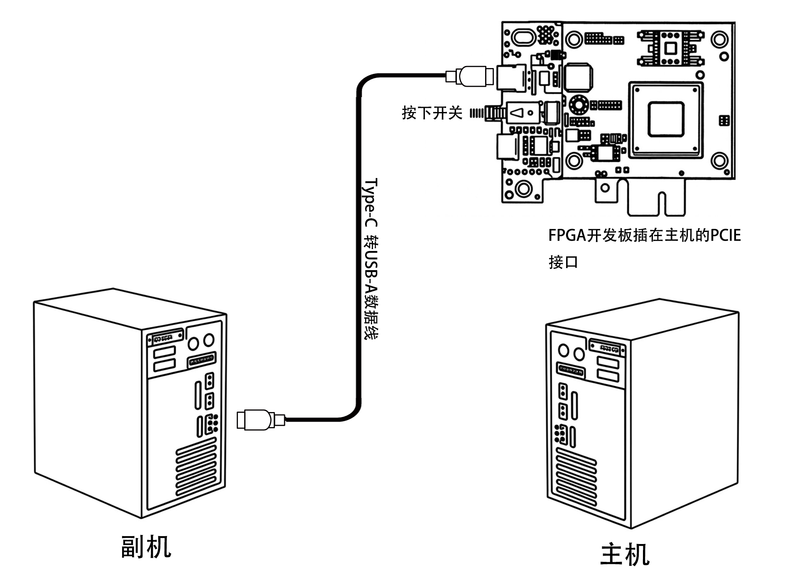
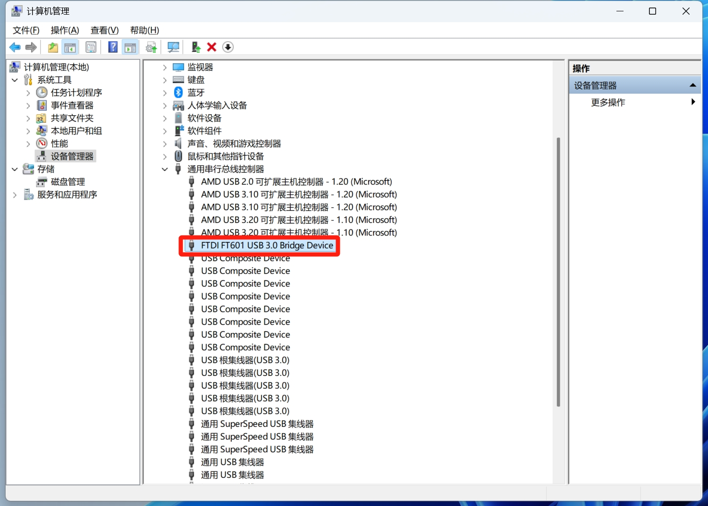
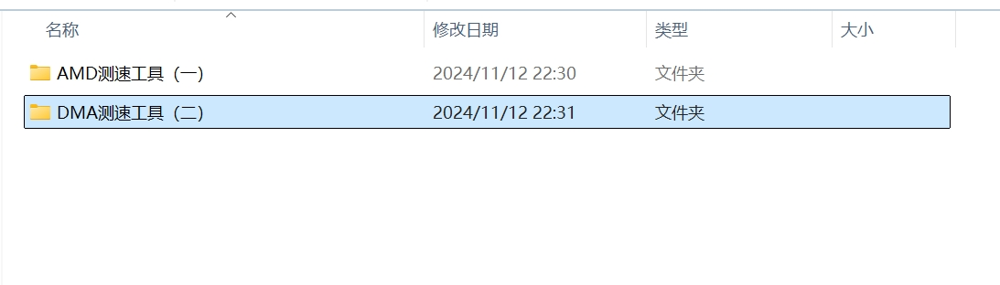
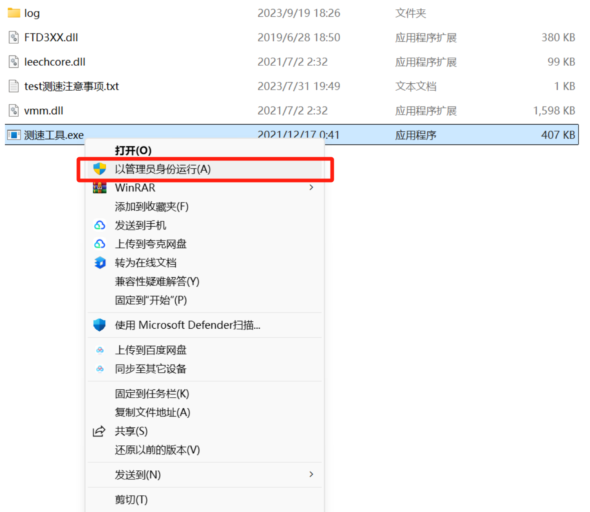
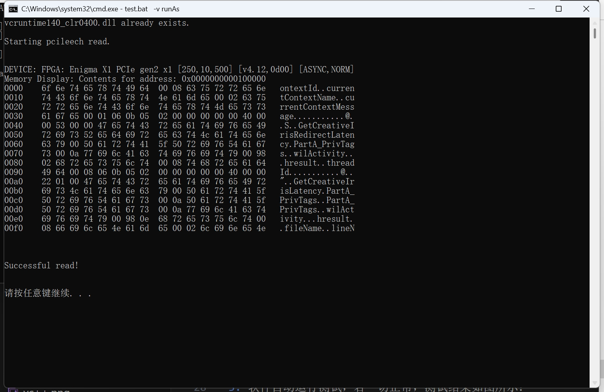
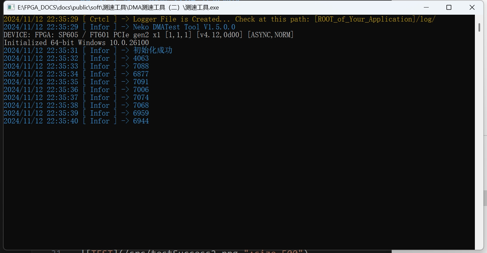

# 测试 MTKMBOX-FPGA开发板连接速度

完成前面的安装过程后，您可以通过本教程来测试 MTKMBOX-FPGA开发板的连接速度。

## 准备工作
::: tip 注意
- 请确保您的`主机`电脑已经完成 `MTKMBOX-FPGA开发板`安装。
- 请确保您的`副机`电脑已经完成 `FTDI驱动`安装。
- 请确保您的`副机`电脑已经完成 `系统必备运行库`安装。
:::

## 第 1 步： 测试 FPGA 连接速度

### 1. 检查线缆是否连接，如图所示：

### 2. 检查 MTKMBOX-FPGA开发板是否被识别，如图所示：

### 3. 打开下载的`AllFpgaTool合集`中 `测速工具`文件夹，解压测速工具，选择`测速工具（二）`，如图所示：

### 4. 右键`测试工具.exe`，管理员模式运行，如图所示：

### 5. 软件自动运行测试，若一切正常，测试结果如图所示：

####  `AMD测速工具（一）`成功截图

####  `测速工具（二）`成功截图

